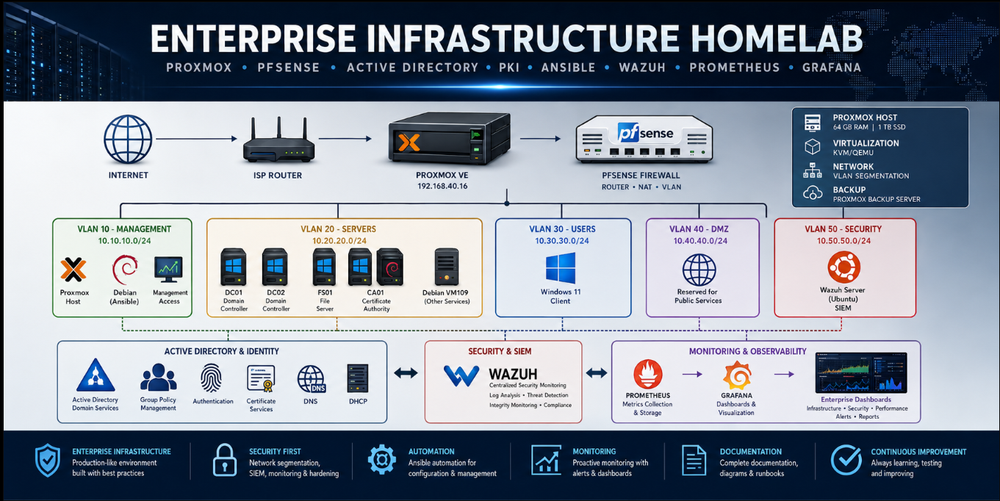

# Enterprise Infrastructure Homelab



> A production-inspired enterprise infrastructure built with Proxmox, pfSense, Active Directory, Linux, Windows Server, Ansible, Wazuh SIEM, Prometheus, and Grafana.


---

# Project Overview

This project simulates a real enterprise IT infrastructure designed to develop practical skills in:

- Systems Administration
- Networking
- Infrastructure Automation
- Cybersecurity
- Monitoring
- Documentation
- DevOps

The environment follows enterprise best practices including network segmentation, centralized authentication, automation, security monitoring, and infrastructure observability.

---

# Architecture

The Enterprise Infrastructure Homelab is designed as a segmented, production-inspired environment integrating virtualization, networking, identity, automation, security monitoring, and observability.

## Complete Enterprise Overview


### Architecture Highlights

- **Proxmox VE** virtualization platform
- **pfSense** firewall, routing, and VLAN segmentation
- **Active Directory** with redundant domain controllers
- **Enterprise PKI** and certificate services
- **Windows Server** file services
- **Ansible** infrastructure automation
- **Wazuh SIEM** centralized security monitoring
- **Prometheus** infrastructure metrics collection
- **Grafana** dashboards and visualization

### Network Segmentation

| VLAN | Name | Network |
|---|---|---|
| 10 | Management | `10.10.10.0/24` |
| 20 | Servers | `10.20.20.0/24` |
| 30 | Users | `10.30.30.0/24` |
| 40 | DMZ | `10.40.40.0/24` |
| 50 | Security | `10.50.50.0/24` |

### Detailed Architecture Documentation

For detailed infrastructure diagrams and technical explanations, see:

➡️ [Enterprise Architecture Documentation](docs/12-Architecture.md)

---

# Technologies

## Virtualization

- Proxmox VE

## Networking

- pfSense
- VLANs
- DNS
- DHCP

## Windows Infrastructure

- Active Directory Domain Services
- Group Policy
- Enterprise Certificate Authority
- File Server

## Linux

- Debian 13
- Ubuntu Server
- OpenSSH

## Automation

- Ansible
- WinRM
- SSH

## Security

- Wazuh SIEM

## Monitoring

- Node Exporter
- Prometheus
- Grafana

---

# Current Infrastructure

| Server | Purpose |
|---------|----------|
| Proxmox | Virtualization Platform |
| pfSense | Firewall & Routing |
| DC01 | Primary Domain Controller |
| DC02 | Secondary Domain Controller |
| FS01 | File Server |
| CA01 | Enterprise Certificate Authority |
| Debian | Ansible & Monitoring |
| Windows 11 | Enterprise Workstation |
| Wazuh | SIEM Platform |

---

# Documentation

| Phase | Document |
|--------|----------|
| Introduction | docs/01-Introduction.md |
| Proxmox | docs/02-Proxmox.md |
| pfSense | docs/03-pfSense.md |
| Network | docs/04-Network.md |
| Active Directory | docs/05-ActiveDirectory.md |
| Enterprise CA | docs/06-CertificateAuthority.md |
| Ansible | docs/07-Ansible.md |
| Wazuh SIEM | docs/08-Wazuh.md |
| Monitoring | docs/09-Monitoring.md |
| Troubleshooting | docs/11-Troubleshooting.md |

---

# Screenshots

The project includes screenshots for every deployment phase.

Topics include:

- Proxmox
- pfSense
- Active Directory
- Windows Administration
- Linux Administration
- Ansible Automation
- Wazuh SIEM
- Prometheus
- Grafana

---

# Skills Demonstrated

## Infrastructure

- Enterprise Virtualization
- Enterprise Networking
- Windows Server Administration
- Linux Administration

## Automation

- Ansible
- PowerShell
- Bash
- SSH
- WinRM

## Security

- Active Directory
- PKI
- Wazuh SIEM
- File Integrity Monitoring
- Security Event Monitoring

## Monitoring

- Prometheus
- Grafana
- Node Exporter
- Enterprise Dashboards
- Infrastructure Monitoring

---

# Project Structure

```text
enterprise-homelab/
├── ansible/
├── diagrams/
├── docs/
├── screenshots/
├── scripts/
├── website/
└── README.md
```

---

# Project Status

## Completed

- Proxmox Deployment
- pfSense Configuration
- VLAN Segmentation
- Active Directory
- Enterprise Certificate Authority
- Windows Administration
- Linux Administration
- SSH Configuration
- WinRM Configuration
- Ansible Automation
- Wazuh SIEM
- Prometheus Monitoring
- Grafana Dashboards

## Upcoming

- Architecture Diagrams
- Portfolio Website Improvements
- Infrastructure Backup
- Disaster Recovery
- Final Documentation

---

# Author

**Zemlah**

Enterprise Infrastructure Homelab

2026
