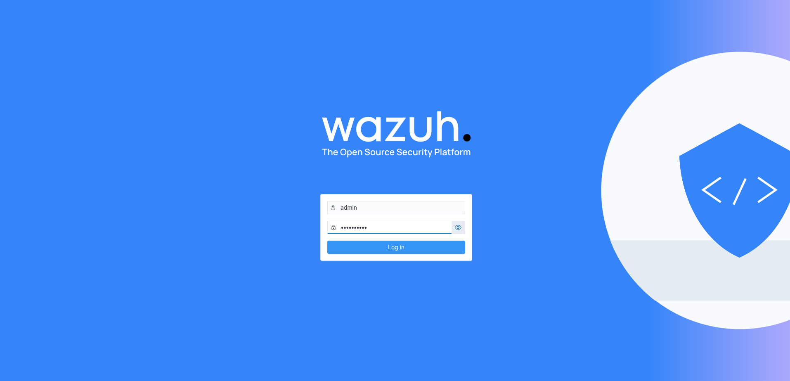

# Wazuh SIEM

## Overview

The Enterprise Homelab includes a complete Wazuh SIEM platform used for:

- Centralized log management
- Endpoint monitoring
- File Integrity Monitoring (FIM)
- Security Event Correlation
- Compliance
- Incident Detection

---

## Infrastructure

| Component | Value |
|------------|--------|
| Server | Ubuntu Server 24.04 |
| Hostname | wazuh-siem |
| IP | 10.50.50.10 |
| Version | 4.14.x |

---

## Connected Agents

| Host |
|------|
| DC01 |
| DC02 |
| File Server |
| CA Server |
| Windows 11 |
| Debian |

---

## Features Enabled

- Agent Monitoring
- Security Monitoring
- File Integrity Monitoring
- Log Collection
- Inventory
- Syscollector
- Vulnerability Detection (planned)

---

## Dashboard

The Wazuh Dashboard provides:

- Active Agents
- Security Events
- MITRE ATT&CK Mapping
- File Integrity Alerts
- Endpoint Inventory

---

## Screenshots

### Login

---

### Dashboard

---

### Active Agents

---

### Security Events

---

### MITRE ATT&CK

---

### File Integrity Monitoring

---

## Skills Demonstrated

- SIEM Deployment
- Endpoint Detection
- Security Monitoring
- Log Management
- Incident Detection
- Windows Event Collection
- Linux Monitoring
