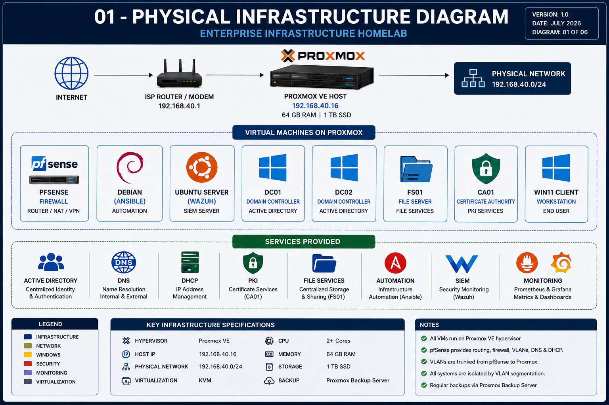
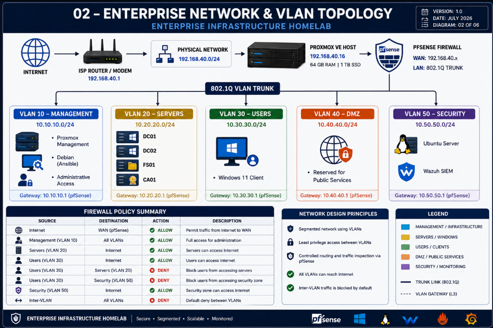
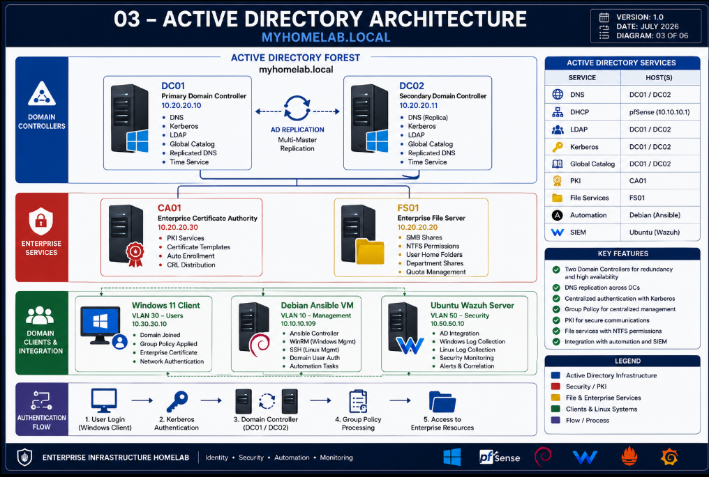
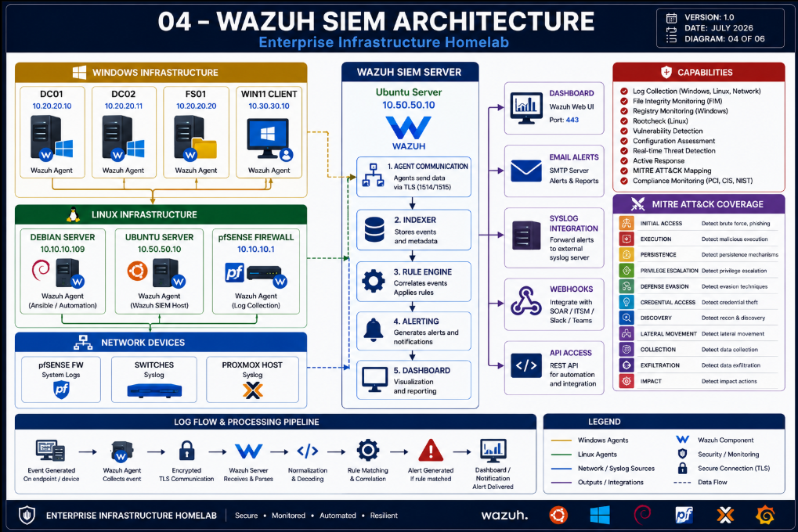
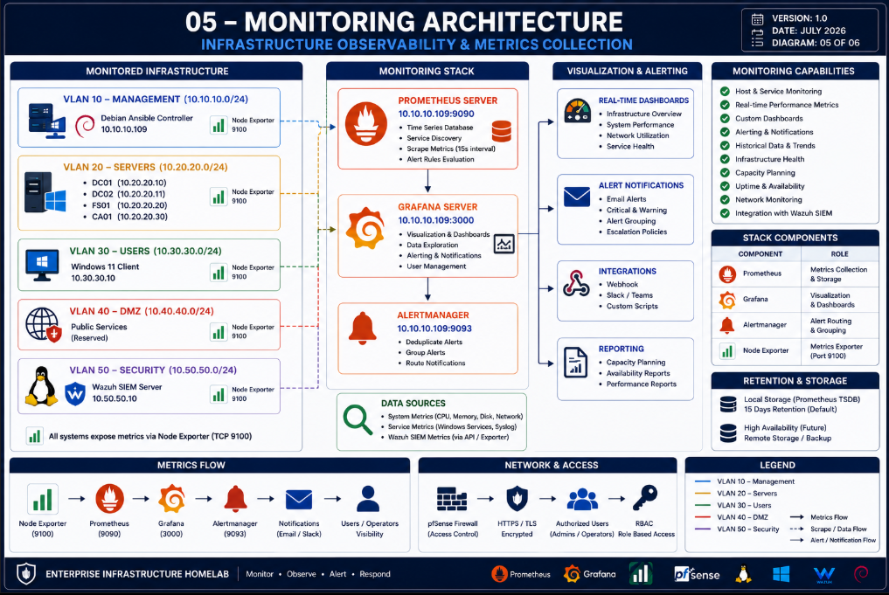
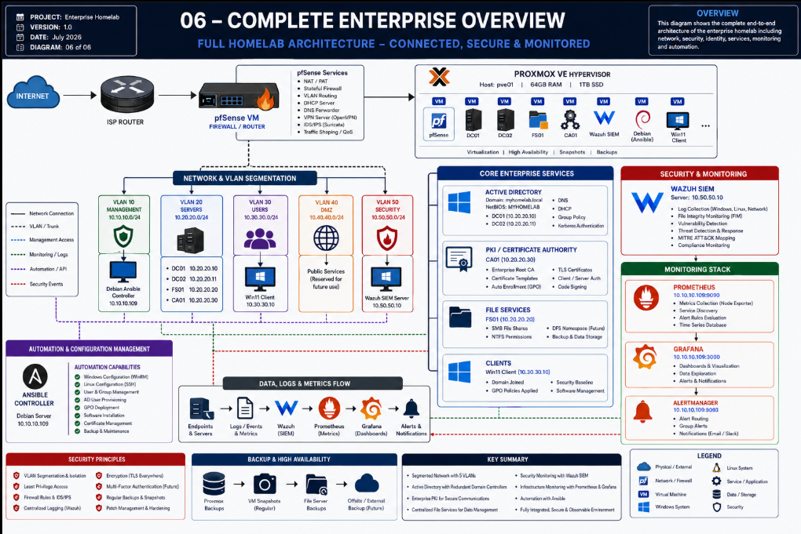

# Enterprise Architecture

This document provides a visual overview of the architecture of the **Enterprise Infrastructure Homelab**.

The environment is designed to simulate a production-inspired enterprise infrastructure using virtualization, network segmentation, centralized identity management, automation, security monitoring, and infrastructure observability.

---

## 01 — Physical Infrastructure



### Overview

The entire enterprise homelab is hosted on a **Proxmox VE hypervisor** with **64 GB of RAM** and **1 TB of SSD storage**.

The Proxmox environment hosts the virtual machines required to provide networking, identity, file services, automation, security monitoring, and observability.

### Core Components

- Proxmox VE hypervisor
- pfSense firewall and router
- Windows Server infrastructure
- Linux infrastructure
- Windows 11 domain client
- Wazuh SIEM
- Prometheus
- Grafana

---

## 02 — Network and VLAN Topology



### Network Segmentation

The network is segmented into dedicated VLANs, with **pfSense** providing routing and firewall enforcement between network segments.

| VLAN | Name | Network | Purpose |
|---|---|---|---|
| 10 | Management | `10.10.10.0/24` | Infrastructure management and automation |
| 20 | Servers | `10.20.20.0/24` | Enterprise Windows servers |
| 30 | Users | `10.30.30.0/24` | Domain workstations |
| 40 | DMZ | `10.40.40.0/24` | Reserved for public-facing services |
| 50 | Security | `10.50.50.0/24` | Security monitoring and SIEM |

### Security Model

- VLANs are isolated by default.
- pfSense controls inter-VLAN routing.
- Management systems have authorized administrative access.
- User systems are separated from security infrastructure.
- Internet access is controlled through firewall policies.
- Security monitoring is centralized in the Security VLAN.

---

## 03 — Active Directory Architecture



### Identity Infrastructure

The Windows infrastructure is built around the Active Directory domain:

```text
myhomelab.local
```

NetBIOS domain name:

```text
MYHOMELAB
```

### Core Systems

| System | Role |
|---|---|
| DC01 | Primary Domain Controller |
| DC02 | Secondary Domain Controller |
| FS01 | Enterprise File Server |
| CA01 | Enterprise Certificate Authority |
| Windows 11 | Domain-joined workstation |

### Enterprise Services

The Active Directory environment provides:

- Centralized authentication
- DNS services
- Kerberos authentication
- LDAP directory services
- Group Policy management
- Domain Controller redundancy
- Enterprise PKI
- Certificate enrollment
- File services
- Centralized access control

---

## 04 — Wazuh SIEM Architecture



### Security Monitoring

The homelab includes a centralized **Wazuh SIEM platform** hosted on the Security VLAN.

Wazuh collects and analyzes security events from Windows and Linux systems.

### Security Capabilities

- Centralized log collection
- Windows event monitoring
- Linux system monitoring
- File Integrity Monitoring (FIM)
- Security event correlation
- Vulnerability detection
- Configuration assessment
- Rootcheck
- Threat detection
- MITRE ATT&CK mapping
- Security dashboards
- Alerting and reporting

### Security Data Flow

```text
Endpoints
    │
    ▼
Wazuh Agents
    │
    ▼
Encrypted Agent Communication
    │
    ▼
Wazuh Server
    │
    ├── Event Analysis
    ├── Rule Matching
    ├── Security Correlation
    └── Alert Generation
            │
            ▼
       Wazuh Dashboard
```

---

## 05 — Monitoring Architecture



### Infrastructure Observability

The monitoring stack provides visibility into infrastructure health and performance.

The primary monitoring technologies are:

- **Node Exporter** — System metrics collection
- **Prometheus** — Metrics collection and time-series storage
- **Grafana** — Dashboards and visualization

### Monitoring Flow

```text
Infrastructure
      │
      ▼
Node Exporter
      │
      ▼
Prometheus
      │
      ▼
Grafana
      │
      ▼
Dashboards and Observability
```

### Monitoring Capabilities

- CPU monitoring
- Memory monitoring
- Disk utilization
- Network metrics
- System uptime
- Performance analysis
- Historical metrics
- Infrastructure dashboards

---

## 06 — Complete Enterprise Overview



### End-to-End Architecture

The complete enterprise architecture integrates all major infrastructure components into a single environment:

- Proxmox virtualization
- pfSense firewall and routing
- VLAN network segmentation
- Active Directory
- DNS and authentication
- Enterprise PKI
- File services
- Windows client infrastructure
- Ansible automation
- Wazuh SIEM
- Prometheus monitoring
- Grafana visualization

The architecture demonstrates how enterprise networking, systems administration, cybersecurity, automation, and observability can be integrated into a production-inspired homelab environment.

---

## Architecture Principles

The environment was designed around the following principles:

### Network Segmentation

Dedicated VLANs separate management, servers, users, DMZ services, and security infrastructure.

### Centralized Identity

Active Directory provides centralized authentication, authorization, and Group Policy management.

### Security Monitoring

Wazuh provides centralized security visibility across Windows and Linux systems.

### Infrastructure Automation

Ansible provides centralized configuration management and administrative automation.

### Observability

Prometheus and Grafana provide infrastructure metrics, visualization, and performance monitoring.

### Defense in Depth

The architecture combines:

- Network segmentation
- Firewall policies
- Centralized authentication
- Enterprise certificates
- Endpoint monitoring
- Centralized logging
- Infrastructure monitoring

---

## Technology Stack

| Category | Technologies |
|---|---|
| Virtualization | Proxmox VE |
| Firewall and Routing | pfSense |
| Identity | Active Directory Domain Services |
| PKI | Active Directory Certificate Services |
| File Services | Windows Server |
| Automation | Ansible |
| Security Monitoring | Wazuh SIEM |
| Metrics | Prometheus |
| Visualization | Grafana |
| Linux | Debian, Ubuntu |
| Client Systems | Windows 11 |

---

## Architecture Diagram Index

| Diagram | Description |
|---|---|
| 01 | Physical Infrastructure |
| 02 | Network and VLAN Topology |
| 03 | Active Directory Architecture |
| 04 | Wazuh SIEM Architecture |
| 05 | Monitoring Architecture |
| 06 | Complete Enterprise Overview |

---

**Enterprise Infrastructure Homelab**  
**Architecture Documentation — Version 1.0**  
**July 2026**
